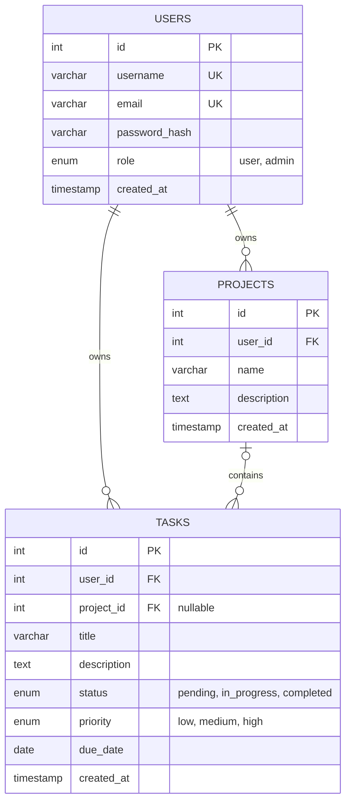

# Task Flow — Database Design (Day 2)

Database engine: **MySQL** (chosen over MongoDB — fixed/predictable fields, relationships enforced via foreign keys, relational JOIN-style queries fit the access patterns).

## ER Diagram

## Tables

### `users`
| Field | Type | Constraint |
|---|---|---|
| id | INT | PK, AUTO_INCREMENT |
| username | VARCHAR(50) | UNIQUE, NOT NULL |
| email | VARCHAR(255) | UNIQUE, NOT NULL |
| password_hash | VARCHAR(255) | NOT NULL |
| role | ENUM('user','admin') | DEFAULT 'user' |
| created_at | TIMESTAMP | DEFAULT CURRENT_TIMESTAMP |

### `projects`
| Field | Type | Constraint |
|---|---|---|
| id | INT | PK, AUTO_INCREMENT |
| user_id | INT | FK -> users.id, NOT NULL |
| name | VARCHAR(100) | NOT NULL |
| description | TEXT | NULL |
| created_at | TIMESTAMP | DEFAULT CURRENT_TIMESTAMP |

### `tasks`
| Field | Type | Constraint |
|---|---|---|
| id | INT | PK, AUTO_INCREMENT |
| user_id | INT | FK -> users.id, NOT NULL |
| project_id | INT | FK -> projects.id, NULL (optional) |
| title | VARCHAR(150) | NOT NULL |
| description | TEXT | NULL |
| status | ENUM('pending','in_progress','completed') | DEFAULT 'pending' |
| priority | ENUM('low','medium','high') | DEFAULT 'medium' |
| due_date | DATE | NOT NULL |
| created_at | TIMESTAMP | DEFAULT CURRENT_TIMESTAMP |

## Relationships

- `users` (1) → `projects` (0..N) — a user owns zero or many projects; every project has exactly one owner.
- `users` (1) → `tasks` (0..N) — a user owns zero or many tasks; every task has exactly one owner.
- `projects` (0..1) → `tasks` (0..N) — a project can contain zero or many tasks; a task optionally belongs to zero or one project (standalone tasks allowed).

Status: **Approved**.
